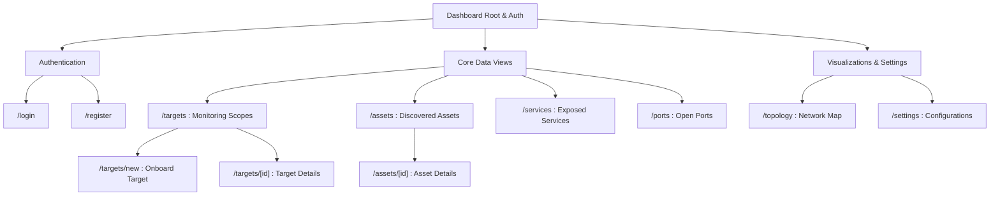
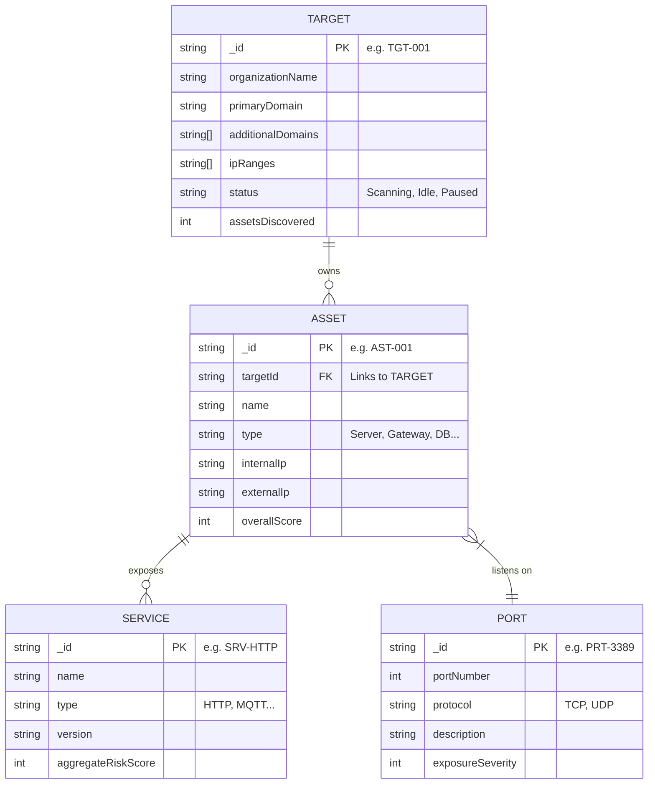
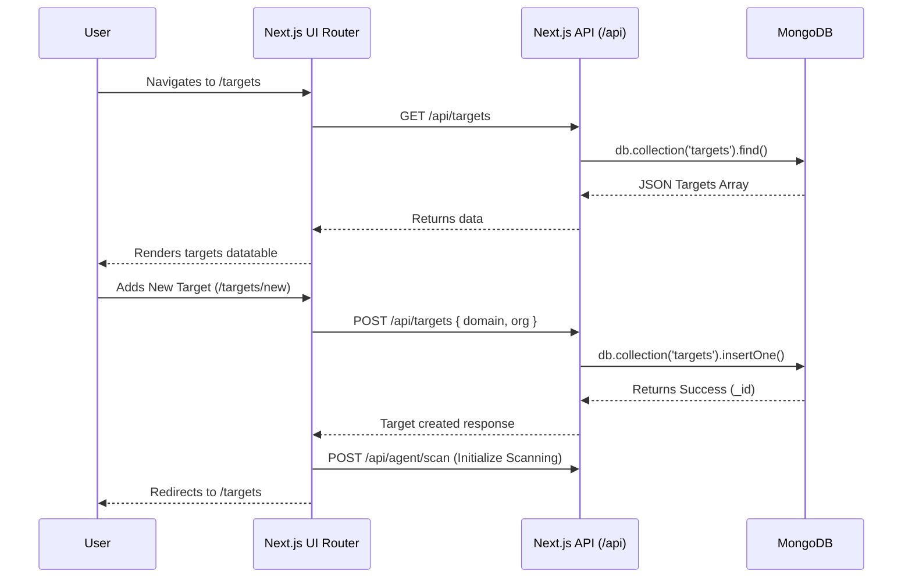

# CYB Infrastructure Dashboard

This is the Next.js frontend and API layer for the CYB Infrastructure Dashboard. It interfaces with MongoDB to present structured data regarding monitoring targets, assets, exposed services, and network topologies.

## Information Architecture

The application is structured using the Next.js App Router. The diagram below illustrates the hierarchical layout of the pages and their core functions.



## Database Schema (MongoDB)

The data is persisted in MongoDB (`cyb_dashboard` database). The entity relationships below describe how targets own assets, which in turn expose services and bind to specific ports.



## App Routes & API Workings

The diagram below details how the frontend interacts with the Next.js API Routes and the underlying Database to fetch data and trigger scan agents.



## Setup & Development

First, run the development server:

```bash
npm run dev
# or
yarn dev
# or
pnpm dev
# or
bun dev
```

Open [http://localhost:3000](http://localhost:3000) with your browser to see the result.

Environment variables required:
- `MONGODB_URI`: Pointer to your MongoDB cluster instance for backend data persistence.

